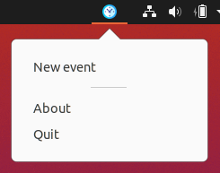

# Sectograph

Аттестация преподавателей 2 года, проект PyQT

## Вдохновение

На телефоне я пользуюсь программой Sectograph:<br>
https://apps.apple.com/us/app/sectograph-visual-time-manager/id1528168188
https://play.google.com/store/apps/details?id=prox.lab.calclock

Она очень красиво и наглядно показывает события из календаря, в виде секторов на циферблате (см. скриншоты программы в appstore или googleplay).

Подобных программ для десктопных систем я не видел, ближайшее по наглядности — это разного вида таблицы день-часы. Поэтому подумал, почему бы не попробовать сделать некий аналог Sectograph (конечно не со всей функциональностью оригинала, т.к. это будет выходить за рамки изученных тем, но я возможно буду доделывать начатое в свободное время).

## ТЗ

Требуется реализовать графическое приложение, которое показывает ближайшие события на циферблате часов в виде секторов. События хранятся в базе данных. События могут иметь уведомления с различными мелодиями. События могут быть повторяющимися или однократными. Также отдельным типом событий являются дневные события (занимают весь день) — они отображаются вокруг циферблата, уведомлений на них поставить нельзя.

## Установка и запуск

Минимальная поддерживаемая версия Python 3.7+, я использую аннотации типов и отложенные аннотации типов, чтобы избежать циклических зависимостей.

Программа использует два сторонних пакета:
- PyQt5 — для интерфейса
- darkdetect — для поддержки светлой и тёмной темы на macOS

Чтобы установить зависимости, из корня проекта нужно запустить
```
pip install -r requirements.txt
```
(на некоторых системах может быть `pip3` вместо `pip`)<br>
(на Ubuntu может потребоваться установить пакет `libqt5x11extras5`)

Программа оформлена как запускаемый пакет, запустить её можно двумя способами:

1. Первый способ (предпочтительный), из корня проекта запустить
```
python -m sectograph
```
(на некоторых системах может быть `python3` вместо `python`)

2. Второй способ, из корня проекта запустить
```
python launcher.py
```
(на некоторых системах может быть `python3` вместо `python`)

Второй способ также пригодится если нужно будет собирать исполняемый файл при помощи PyInstaller, т.к. он не поддерживает исполняемые модули (https://github.com/pyinstaller/pyinstaller/issues/2560)

## Интерфейс

Основное окно программы представляет собой циферблат часов. На циферблате отображаются часовая, минутная и секундная стрелки, показывающее текущее системное время. На месте цифры 12 с 2-х часов ночи до 2-х часов дня отображается солнце, после 2-х часов дня — месяц (некий аналог AM/PM).

Под циферблатом справа отображается кнопка добавления нового события, слева — кнопка для отображения окошечка «О программе».

На macOS автоматически поддерживается светлая и тёмная темы, в Windows/Linux используется светлая тема.

Должны автоматически поддерживаться HiDPI дисплеи с включенным масштабированием. Видимый размер интерфейса на разных операционных системах одинаковый, скриншоты с macOS могут выглядеть больше из-за того, что в macOS на дисплее Retina используется 144 DPI, в отличие от 96 DPI на обычном мониторе.

### Основное окно программы

|**macOS Catalina (dark)**|**macOS Catalina (light)**|
|:--------:|:---------:|
|||
|**Windows 10**|**Ubuntu 20.04**|
|||

### Окно «О программе»

|**macOS Catalina (dark)**|**macOS Catalina (light)**|
|:--------:|:---------:|
|||
|**Windows 10**|**Ubuntu 20.04**|
|||

### Окно добавления/редактирования событий

|**macOS Catalina (dark)**|**macOS Catalina (light)**|
|:--------:|:---------:|
|||
|**Windows 10**|**Ubuntu 20.04**|
|||

### Иконка в трее и меню

В macOS используется монохромная иконка, в Windows/Linux — цветная.

|**macOS Catalina (dark)**|**macOS Catalina (light)**|
|:--------:|:---------:|
|||
|**Windows 10**|**Ubuntu 20.04**|
|||

### Добавление событий

Чтобы добавить событие, нужно кликнуть на кнопку «+» в нижнем-правом углу, либо нажать "+" на клавиатуре, при активном главном окне, либо выбрать пункт меню «New event» в меню в трее.

События делятся на два типа:

- которые занимают весь день (праздник/выходной/день рождения)
- которые занимают какой-то участок времени

При создании события галочкой отмечается тип события. У разных типов событий немного отличаются поля — у дневных событий есть только дата и для них нельзя добавить напоминание. Для интервальных событий указывается дата-время начала и дата-время окончания события.

После создания события оно сразу же отобразится на циферблате (конечно, если его нужно отображать). Интервальные события отображаются секторами, дневные — располагаются вокруг циферблата.

### Редактирование событий

Для редактирования любого видимого события нужно нажать на него мышкой и выбрать событие в выпадающем меню. Если на месте клика мышкой находятся два или более события — в выпадающем меню будет соответствующее количество пунктов.


Откроется заполненная форма редактирования.

### Обзор различных элементов интерфейса


## База данных

В базе данных две несвязанные между собой таблицы:

- `events` — здесь хранятся все события
- `colors` — здесь находится список предустановленных цветов для событий


Поле `color` в табоице `events` не имеет связи с таблицей `colors` потому, что цвет для события можно указать любой (в том числе и в виде HEX строки). В таблице `colors` хранится лишь те цвета, которые появляются в выпадающем списке, просто как возможные варианты.

Список звуков уведомлений не хранится в отдельной таблице потому, что файлы звуков запакованы в файл ресурсов и просто добавить или удалить их нельзя, поэтому я решил, что дублировать их ещё и в таблице в БД будет излишне.

По структуре и сложности базы данных никаких требований нет, поэтому искусственно усложнять другими таблицами и связями я её не стал. Запросы в БД и так достаточно нетривиальные (см., например, класс репозитория интервальных событий `sectograph/repositories/event.py`) :)

## Диаграмма классов и пакетов

(Построено автоматически при помощи `pyreverse`)


## Что можно улучшить/доделать в будущем

### Функциональность

- Добавить поддержку «листания» дней (или полу-дней), вперёд и назад. Сейчас нет никакой возможности редактировать события, которые ещё не видны. В программе есть функциональность установки конкретного времени (если обратить внимание — все скриншоты сделаны с одним и тем же временем), нужно только добавить эту функциональность в интерфейс.
- Добавить возможность менять/редактировать темы. Сами темы — это `json` файлы в ресурсах, то есть сейчас их легко редактировать нельзя.
- Добавление своих мелодий уведомлений, для этого их тоже нужно будет вынести из файла ресурсов.
- Сделать интеграцию с системным календарём и/или Google-календарём (любым календарём с форматом `.ics`), но это выходит за рамки проекта PyQT.

### Реализация

- Всё, что рисуется в интерфейсе — рисуется прямо на виджетах при помощи `QPainter`. Я, к сожалению, достаточно поздно приступил к проекту, вероятно было бы лучше реализовать интерфейс используя `QGraphicsScene` и `QGraphicsWidget`. В дальнейшем я постараюсь исследовать эту тему.
- Мелодии уведомлений иногда похрипывают, хотелось бы вынести проигрывание в отдельный поток (впрочем, многопоточные программы тоже выходят за рамки изученного).
- Хотелось бы, чтобы главное окно можно было закрывать, и программа осталась работать в трее. Я это реализовывал, но мне не очень понравилось поведение, нужно ещё время на исследования. Вообще, работа с треем в Qt довольно забагованная, судя по обилию баг-репортов...
